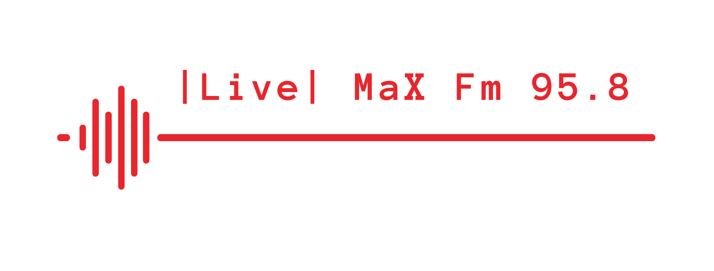

  

# Web Scraping and Automation the Spotify Playlist with Javascript
- This project was made by using the Spotify API. API endpoints and methods were used to reach the uniq id of the song whose name information we have and to add it to the playlist with that id.

# What is that?

- This project was done in order to make the songs played by a very popular radio channel both accessible and up-to-date like listening to the radio. Regularly adding these songs to the spotify playlist with instant song information taken from the radio show. In addition, in order to keep the list up to date, it is aimed to delete the oldest added track from the list after each added track.

# How was it made?

All written in javaScript using puppeteer, expressJs, axios and fs. The steps to be followed are given below.

  1- The song name and artist name information will be obtained from the website of the radio channel.  
  2- Authorization will be done to communicate with the Spotify API.  
  3- Requests will be made to Spotify API endpoints after authorization; The unique id of the song will be taken, and then a request to add to the playlist will be made with this id.  
  4- The information of the songs that are currently in the playlist will be retrieved and a request to be deleted from the playlist for the oldest song according to the date of addition.

You can take a look at the <a href="https://akifkrdg.medium.com/spotify-playlist-automation-and-web-scraping-with-javascript-f8410403142a" target="_blank">blog post</a> I wrote for the construction details. 

# For running

  - For cloning the repository:  
    `git clone https://github.com/MichaelScarnnn/spotify-api-web-scraping-live-radio.git`   
  - For dependencies:  
    `npm install`
